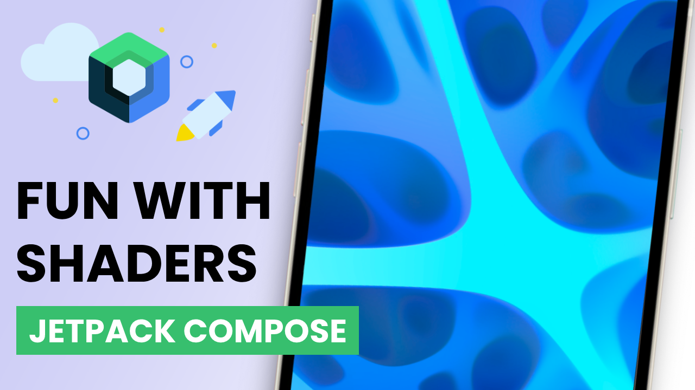

# Having fun with AGSL Shaders in Jetpack Compose

## [Watch it on YouTube](https://youtu.be/aHzFRPSo2s0)

Explore the fascinating world of Android Graphics Shading Language (AGSL)! Discover how AGSL, available from Android 13 and onwards, empowers you to define the behavior of programmable RuntimeShader objects. AGSL shares its syntax with GLSL fragment shaders and allows you to unleash your creativity within the Android graphics rendering system, customizing Canvas painting and filtering View content. Dive into the details in this source code!

### Preview

